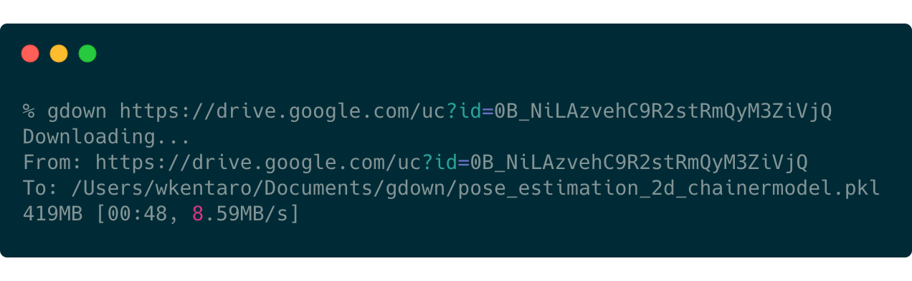
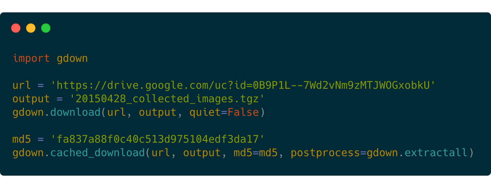

<h1 align="center">
  gdl
</h1>

<h4 align="center">
  Download a large file from Google Drive.
</h4>

<div align="center">
  <a href="https://pypi.python.org/pypi/gdl"></a>
  <a href="https://pypi.org/project/gdl"></a>
  <a href="https://github.com/wkentaro/gdl/actions"></a>
</div>

<div align="center">
  
  
</div>

<br/>


## Description

Download a large file from Google Drive.  
If you use curl/wget, it fails with a large file because of
the security warning from Google Drive.
Supports downloading from Google Drive folders (max 50 files per folder).


## Installation

```bash
pip install gdl

# to upgrade
pip install --upgrade gdl
```


## Usage

### From Command Line

```bash
$ gdl --help
usage: gdl [-h] [-V] [-O OUTPUT] [-q] [--fuzzy] [--id] [--proxy PROXY]
             [--speed SPEED] [--no-cookies] [--no-check-certificate]
             [--continue] [--folder] [--remaining-ok]
             url_or_id
...

$ # a large file (~500MB)
$ gdl https://drive.google.com/uc?id=1l_5RK28JRL19wpT22B-DY9We3TVXnnQQ
$ md5sum fcn8s_from_caffe.npz
256c2a8235c1c65e62e48d3284fbd384

$ # same as the above but with the file ID
$ gdl 1l_5RK28JRL19wpT22B-DY9We3TVXnnQQ

$ # a small file
$ gdl https://drive.google.com/uc?id=0B9P1L--7Wd2vU3VUVlFnbTgtS2c
$ cat spam.txt
spam

$ # download with fuzzy extraction of a file ID
$ gdl --fuzzy 'https://drive.google.com/file/d/0B9P1L--7Wd2vU3VUVlFnbTgtS2c/view?usp=sharing&resourcekey=0-WWs_XOSctfaY_0-sJBKRSQ'
$ cat spam.txt
spam

$ # --fuzzy option also works with Microsoft Powerpoint files
$ gdl --fuzzy "https://docs.google.com/presentation/d/15umvZKlsJ3094HNg5S4vJsIhxcFlyTeK/edit?usp=sharing&ouid=117512221203072002113&rtpof=true&sd=true"

$ # a folder
$ gdl https://drive.google.com/drive/folders/15uNXeRBIhVvZJIhL4yTw4IsStMhUaaxl -O /tmp/folder --folder

$ # as an alternative to curl/wget
$ gdl https://httpbin.org/ip -O ip.json
$ cat ip.json
{
  "origin": "126.169.213.247"
}

```

### From Python

```python
import gdl

# a file
url = "https://drive.google.com/uc?id=1l_5RK28JRL19wpT22B-DY9We3TVXnnQQ"
output = "fcn8s_from_caffe.npz"
gdl.download(url, output, quiet=False)

# same as the above, but with the file ID
id = "0B9P1L--7Wd2vNm9zMTJWOGxobkU"
gdl.download(id=id, output=output, quiet=False)

# same as the above, and you can copy-and-paste a URL from Google Drive with fuzzy=True
url = "https://drive.google.com/file/d/0B9P1L--7Wd2vNm9zMTJWOGxobkU/view?usp=sharing"
gdl.download(url=url, output=output, quiet=False, fuzzy=True)

# cached download with identity check via MD5
md5 = "fa837a88f0c40c513d975104edf3da17"
gdl.cached_download(url, output, md5=md5, postprocess=gdl.extractall)

# a folder
url = "https://drive.google.com/drive/folders/15uNXeRBIhVvZJIhL4yTw4IsStMhUaaxl"
gdl.download_folder(url, quiet=True, use_cookies=False)

# same as the above, but with the folder ID
id = "15uNXeRBIhVvZJIhL4yTw4IsStMhUaaxl"
gdl.download_folder(id=id, quiet=True, use_cookies=False)
```


## License

- Total credit goes to https://github.com/wkentaro/gdown
